## AWS Managed Service For Grafana

**Introduction**
- Amazon Managed Service for Grafana (AMG) is a fully managed and secure data visualization service that enables customers to instantly query, correlate, and visualize operational metrics, logs, and traces for their applications from multiple data sources. AMG is based on the open source Grafana project, a widely deployed data visualization tool popular for its extensible data source support. 
- Customers also benefit from built-in security features that enable compliance with governance requirements, including single sign-on, fine-grained data access control, and audit reporting. 
- AMG is integrated with AWS data sources that collect operational data, such as Amazon CloudWatch, Amazon Elasticsearch Service, Amazon Timestream, AWS IoT SiteWise, AWS X-Ray, and Amazon Managed Service for Prometheus (AMP), and provides plug-ins to popular open-source databases, third-party ISV monitoring tools, as well as other cloud services. 
- With AMG you can easily visualize information from multiple AWS services, AWS accounts, and Regions in a single Grafana dashboard.
- This tutorial is divided into below sections
    - Create Workspace
    - Add User
    - Query metrics/logs from AWS Cloudwatch

**Tutorial**

- Step 1. Create Workspace

  **Prerequisite** - AMG requires AWS SSO enabled in your account. AWS SSO is used as the authentication provider to sign into the AMG workspace. Please follow this tutorial to <a href="https://sanchitdilipjain.github.io/enable-aws-sso/"> enable AWS SSO.</a>

  1. Go to the <a href="https://console.aws.amazon.com/grafana/home/createWorkspace"> AMG console </a>
       
     
    
  2. Select Create Workspace from the right side of the console
    
  3. Provide Workspace Name and Description and select Next
       
     
  
  4. Select Service managed in the Configure Settings page and click Next
  
     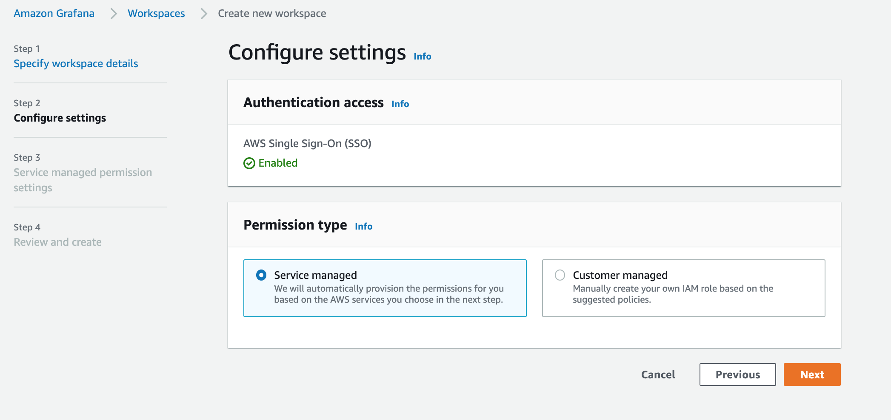
  
  5. In this section, you can choose to deploy Grafana to track resources in the current account or across multiple AWS accounts by selcting the Organization option and click Next
  
     
  
  6.  In the Review screen, verify the selection and select on Create workspace

     

- Step 2. Add User
    
  1. After the workspace is Active, click on Assign user and select the SSO user available. Click Assign user
       
     
     
     
  
  2. By default, all newly assigned users are added as Viewers that only provides read-only permissions on Grafana. To make the user as Administrator, select the user under Users and select Make admin. Now you should see that the user is an Administrator.

     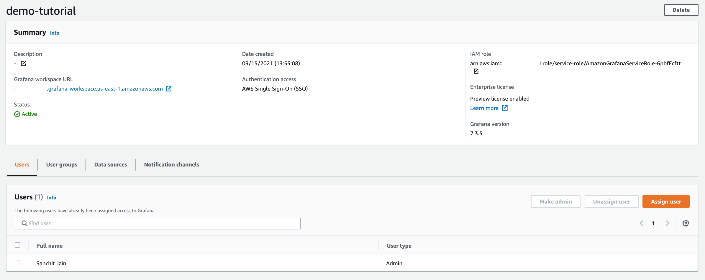

- Step 3. Query metrics/logs from AWS Cloudwatch
 
  1. CLick the Grafana workspace URL from the workspace we deployed above

  2. Authenticated yourself via AWS SSO
  
      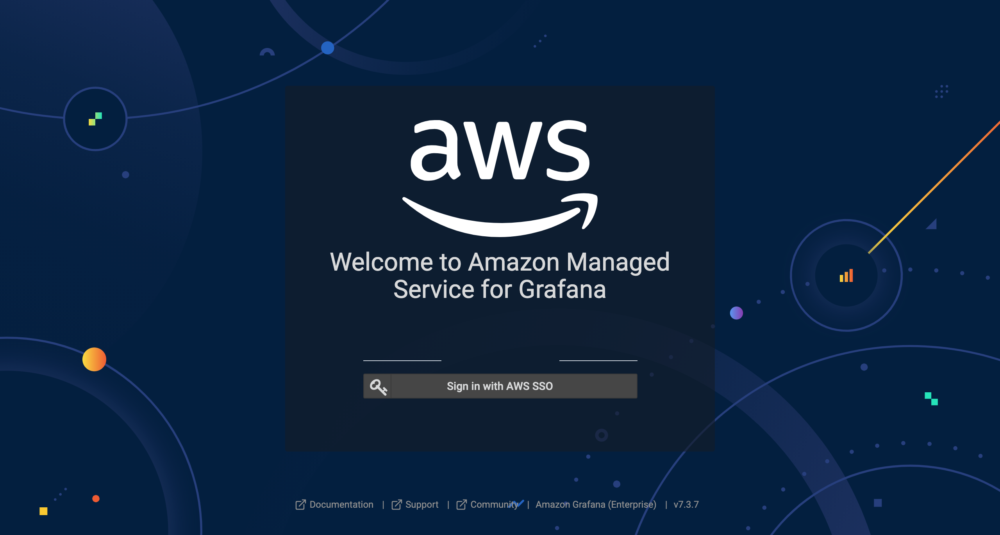 
    
  3. Click AWS services from the AWS logo on the left navigation bar, which allow you to add Data Source
  
      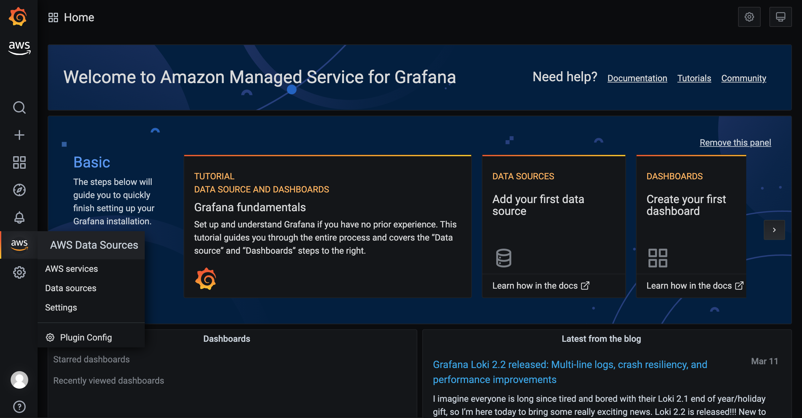 
  
  4. Select CloudWatch as the datasource from the AWS Data Sources screen
  
      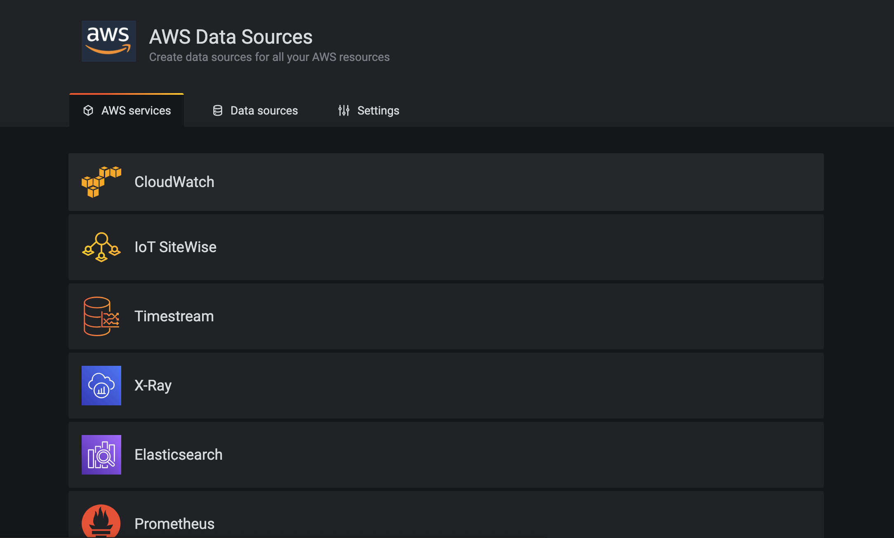 
     
  5. Select the AWS Region and click on Add data source to add CloudWatch as a data source
  
      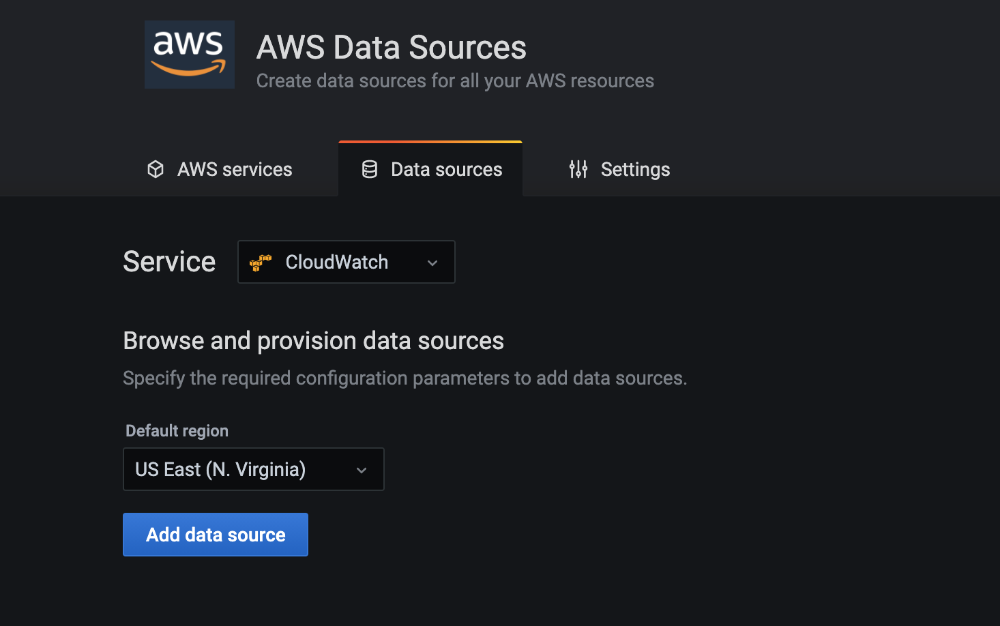 
    
  6. Next click on Go to settings and select the Dashboards tab and verify the connection 
  
      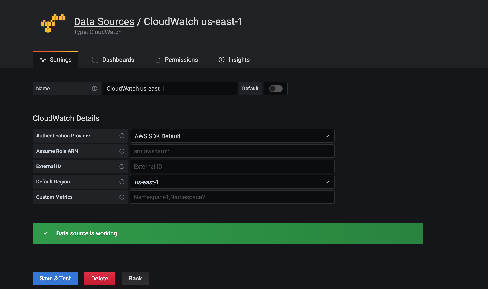 
  
  7. The CloudWatch data source plugin comes with a few of dashboards build-in  
  
      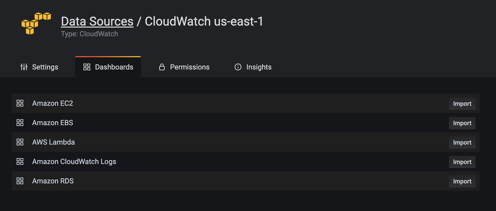 
    
  8. Select on Import on the dashboards as shown below
  
      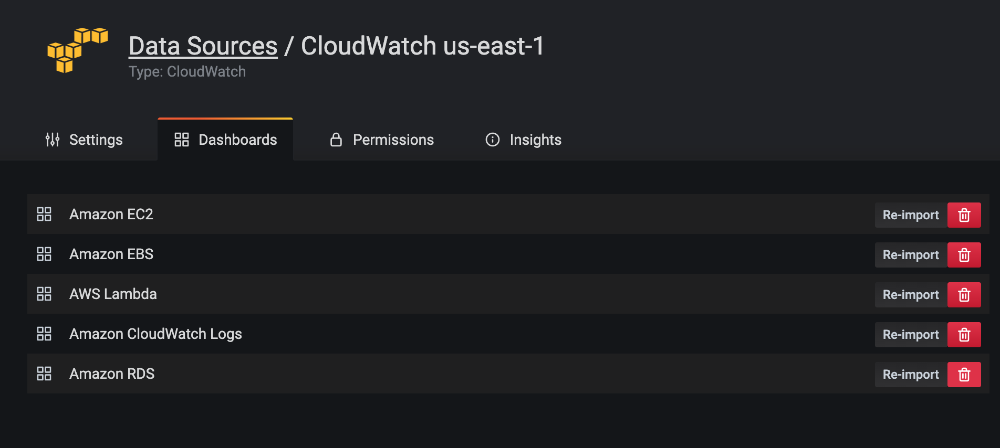 
  
  9. Next we will check the metrics and logs being visualized.
  
    - EC2 
    
        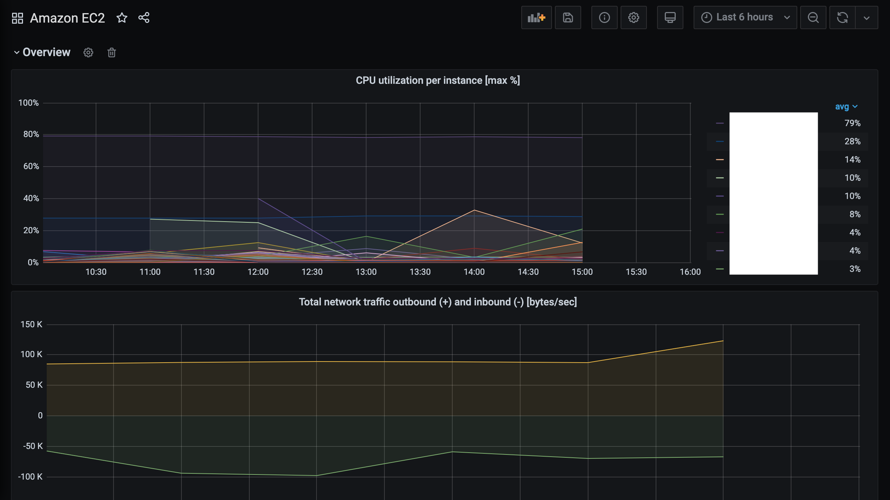 
      
    - EBS
      
        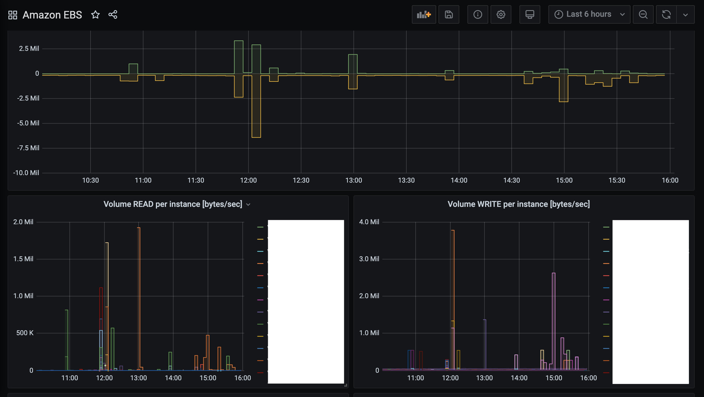 
      
    - Lambda
      
        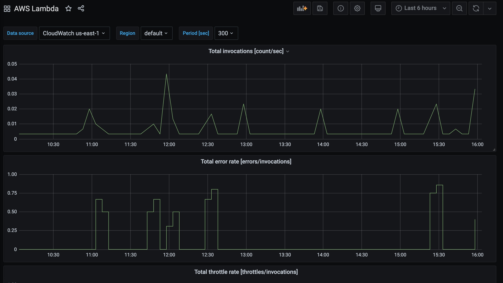 
      
    - RDS
      
        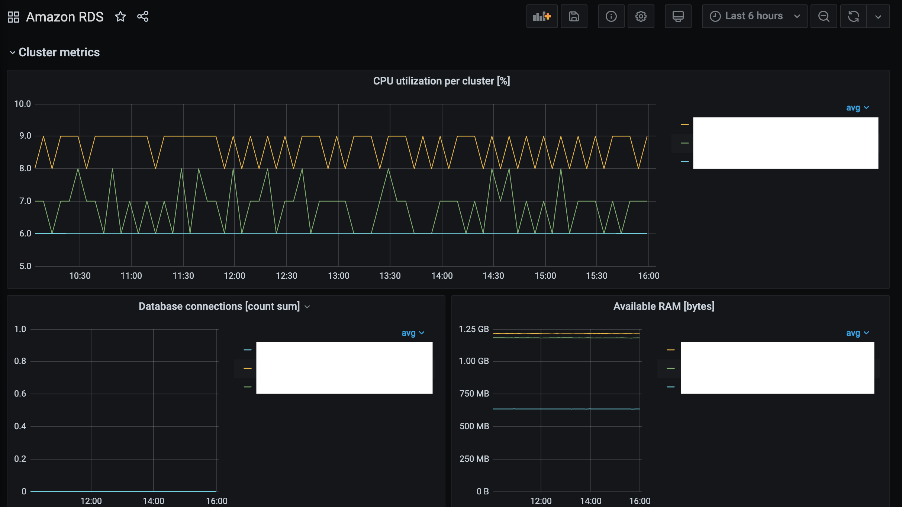 
      
