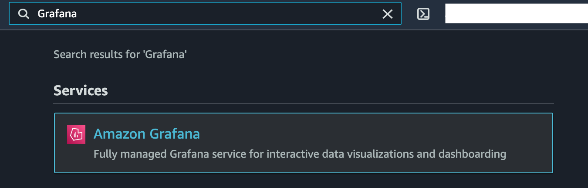

## AWS Managed Service For Grafana

**Introduction**
- Amazon Managed Service for Grafana (AMG) is a fully managed and secure data visualization service that enables customers to instantly query, correlate, and visualize operational metrics, logs, and traces for their applications from multiple data sources. AMG is based on the open source Grafana project, a widely deployed data visualization tool popular for its extensible data source support. 
- Customers also benefit from built-in security features that enable compliance with governance requirements, including single sign-on, fine-grained data access control, and audit reporting. 
- AMG is integrated with AWS data sources that collect operational data, such as Amazon CloudWatch, Amazon Elasticsearch Service, Amazon Timestream, AWS IoT SiteWise, AWS X-Ray, and Amazon Managed Service for Prometheus (AMP), and provides plug-ins to popular open-source databases, third-party ISV monitoring tools, as well as other cloud services. 
- With AMG you can easily visualize information from multiple AWS services, AWS accounts, and Regions in a single Grafana dashboard.
- This tutorial is divided into below sections
    - Create Workspace
    - Query metrics/logs from AWS Cloudwatch
    - Query X-RAY trace Data

**Tutorial**

- Step 1. Create Workspace

  **Prerequisite** - AMG requires AWS SSO enabled in your account. AWS SSO is used as the authentication provider to sign into the AMG workspace. Please follow this tutorial to <a href="https://sanchitdilipjain.github.io/enable-aws-sso/"> enable AWS SSO.</a>

  1. Go to the <a href="https://console.aws.amazon.com/grafana/home/createWorkspace"> AMG console </a>
       
     
    
  2. Select Create Workspace
       
     
    
  3. Provide Workspace Name and Description
       
     
    
